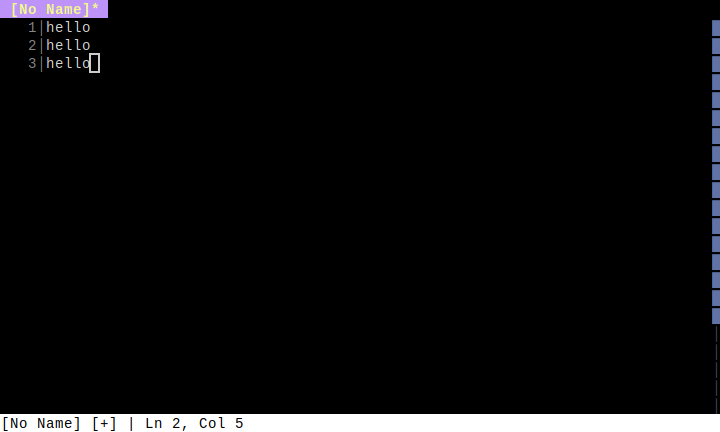
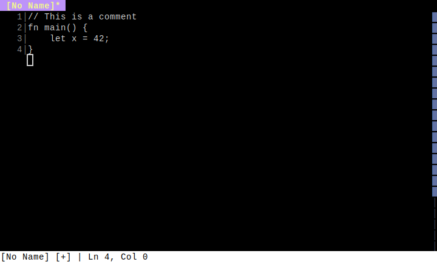
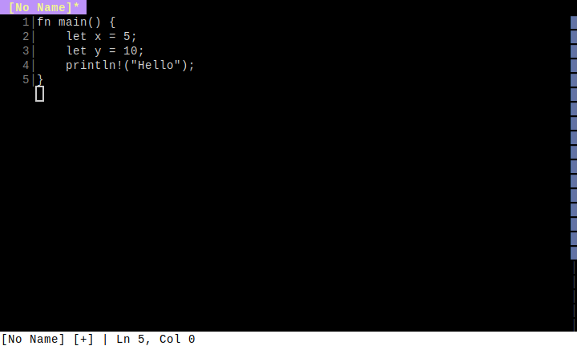

# Visual Regression Test Documentation

This document shows the visual state of the editor at different steps in user flows.
Screenshots are automatically generated by running `cargo test`.

**Note**: These screenshots are generated from E2E tests and serve as both:
- Visual regression tests (detect unintended UI changes)
- Living documentation (always up-to-date with the current UI)

---

## Advanced Editing

### [Multiple Cursors](tests/Multiple_Cursors.md)

*Using multiple cursors for simultaneous edits*

---

## Appearance

### [Theme Colors](tests/Theme_Colors.md)

*Editor color scheme and syntax highlighting*

---

## Core Features

### [Basic Editing](tests/Basic_Editing.md)

*Basic text editing operations in the editor*

---

### [Command Palette](tests/Command_Palette.md)

*Using the command palette to execute commands*

---

### [Help System](tests/Help_System.md)

*Viewing keybindings and help information*

---

## File Management

### [File Explorer](tests/File_Explorer.md)

*Opening and navigating the file explorer*

---

## Language Features

### [LSP Diagnostics](tests/LSP_Diagnostics.md)

*Displaying LSP diagnostics with margin indicators*

---

## Layout

### [Split View](tests/Split_View.md)

*Working with split panes*

---

